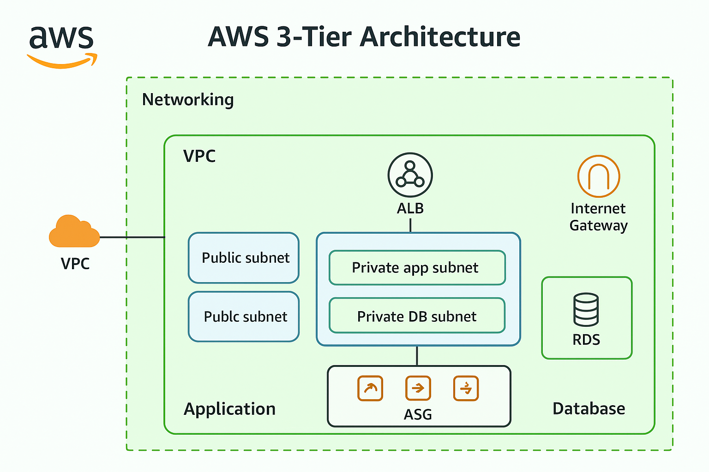

# 🚀 AWS 3-Tier Architecture using Terraform (Infrastructure as Code)

## 📌 Overview
This project demonstrates the design, automation, testing, and validation of a production-style 3-tier architecture on AWS, fully provisioned using Terraform (Infrastructure as Code).
The project emphasizes scalability, security, high availability, automation, and operational readiness, following real-world cloud engineering best practices.

---

## 🏗️ Architecture Diagram

> High-level view of a secure, scalable AWS 3-tier architecture deployed across multiple Availability Zones.

---
### Diagram Explanation
* Public subnets host the Application Load Balancer (ALB) for internet-facing traffic.
* Private application subnets host EC2 instances managed by an Auto Scaling Group.
* Private DB subnets host Amazon RDS for secure, persistent storage.
* NAT Gateway provides outbound internet access for private EC2 instances.
* Security groups enforce least-privilege access between ALB → EC2 → RDS.
* CloudWatch + SNS monitor system health and send alerts for operational events.

## Request Flow

1. A user sends an HTTP request to the Application Load Balancer.
2. ALB receives traffic via the Internet Gateway.
3. ALB forwards requests to healthy EC2 instances in private application subnets.
4. EC2 instances process requests and securely connect to Amazon RDS.
5. RDS responds only to the application tier using security group rules.
6. Responses return to the user via the ALB.
7. NAT Gateway enables outbound internet access for private resources.

## 🧱 Architecture Components

### 1️⃣ Networking Layer (Terraform-managed)
* Custom VPC with CIDR planning
* Public, private application, and private DB subnets
* Multi-AZ subnet deployment
* Internet Gateway for inbound traffic
* NAT Gateway for outbound internet access
* Dedicated route tables per subnet tier

### 2️⃣ Application Layer
* Application Load Balancer (internet-facing)
* ALB listener forwarding traffic to target group
* EC2 Launch Template with automated user-data
* Auto Scaling Group for high availability and self-healing
* Private EC2 instances (no public IPs)

### 3️⃣ Database Layer
* Amazon RDS (MySQL)
* Private DB subnet group
* No public accessibility
* Access restricted via security group–to–security group rules
* Credentials securely stored in AWS Secrets Manager

---

## 🔐 Security Design
* Least-privilege security groups
* ALB as the only internet-facing component
* EC2 and RDS in private subnets
* No hardcoded secrets in Terraform
* Database credentials managed via AWS Secrets Manager
* Encrypted Terraform remote backend (S3 state storage)

---

## 📈 Scalability & High Availability
* Auto Scaling Group across multiple AZs
* CPU-based scaling policies
* ALB health checks for traffic routing
* Automatic replacement of unhealthy instances
* Stateless application servers

---

## 📊 Monitoring & Alerting
* CloudWatch metrics for EC2 and Auto Scaling Group
* CPU utilization alarms
* SNS email notifications for operational alerts
* Tested alarm triggering using CPU stress testing

---

## 🧪 Testing & Validation Performed
* Verified ALB routing and target health checks
* Simulated EC2 failure and confirmed self-healing
* Performed CPU stress testing to trigger scale-out
* Validated scale-in after load reduction
* Confirmed private RDS connectivity from EC2 only
* Verified SNS email notifications on alarm state change

---

## 🧠 Infrastructure Automation (Terraform)
* Modular Terraform configuration
* Infrastructure fully reproducible
* Remote backend using S3 with encryption
* State locking enabled to prevent concurrent modifications
* Dependency-aware resource creation

---

## 💰 Cost Optimization
* Free Tier–eligible instance types
* Auto Scaling prevents over-provisioning
* NAT Gateway created only when required
* All resources cleaned up after testing
---

## 🧠 Challenges & Learnings
* Debugged real Terraform dependency and ordering issues
* Learned ALB listener and target group association behavior
* Understood CloudWatch metric aggregation delays
* Resolved RDS engine and instance class compatibility issues
* Gained hands-on experience with production-style troubleshooting

---

🛠️ AWS Services Used
* VPC
* EC2
* Auto Scaling
* Application Load Balancer
* RDS
* Secrets Manager
* CloudWatch
* SNS
* IAM
* Terraform

---

## 🧹 Cleanup
All AWS resources were destroyed using Terraform in a dependency-aware manner to ensure no orphaned infrastructure and no unnecessary costs.

---

## 🏁 Conclusion
This project showcases real-world AWS infrastructure design and automation, focusing on scalability, security, monitoring, and operational maturity using Terraform.
